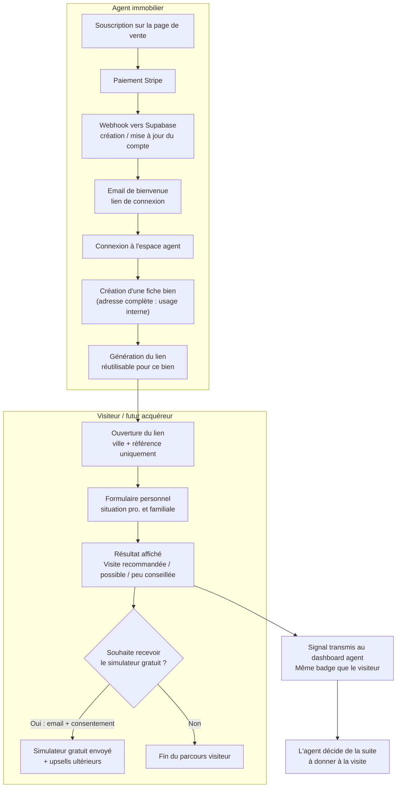

# Parcours client — Les Clés du Crédit

## Points ajustés par rapport à la description initiale
1. **Abonnement mensuel**, pas annuel (17 €/mois les 6 premiers mois, puis 27 €/mois) — à confirmer si une option annuelle doit être ajoutée en plus.
2. **Champ "ancien/neuf" réintégré** dans la fiche bien — indispensable au calcul des frais de notaire, à ne pas retirer.
3. **Un seul lien par bien**, réutilisable et partageable à plusieurs visiteurs — pas un lien régénéré à chaque nouveau client.
4. **Ajout** : un email de bienvenue avec lien de connexion, envoyé à l'agent juste après la création de son compte.
5. **Précision** : la phrase d'incitation au simulateur gratuit change de formulation selon le statut (visite recommandée / possible / peu conseillée), pas un texte unique.
6. **L'adresse complète n'est jamais transmise au visiteur** — seule la ville et la référence du bien lui sont affichées, avant et après sa simulation. C'est l'agent seul qui communique l'adresse exacte, une fois la visite fixée, en dehors de l'outil (pratique standard du métier pour éviter le contournement de l'agent).
7. **Libellés de verdict unifiés** : agent et acquéreur voient le même badge (Visite recommandée / Visite possible / Visite peu conseillée) — plus de vocabulaire "compatible". Le détail pédagogique est réservé à l'acquéreur. Le verdict Agent repose sur la durée max applicable (`reference_simulation`), pas sur une durée personnelle.

---

## Parcours rédigé

### 1. Souscription de l'agence
L'agent arrive sur la page de vente du site Les Clés du Crédit et souscrit à l'abonnement mensuel (17 €/mois les 6 premiers mois, puis 27 €/mois).

### 2. Activation du compte
Stripe enregistre le paiement et déclenche un webhook vers Supabase. Si l'agent est nouveau, son compte et ses accès sont créés automatiquement ; s'il existe déjà (renouvellement, changement de moyen de paiement), son statut est simplement mis à jour. Un email de bienvenue contenant un lien de connexion (magic link) lui est envoyé via Brevo.

### 3. Connexion et création d'une fiche bien
L'agent se connecte à son espace et crée une fiche bien : nom de la résidence, **adresse complète (usage interne uniquement)**, référence de l'annonce, montant de la transaction, type ancien/neuf (détermine le taux de frais de notaire appliqué), et chiffrage des travaux si le bien en nécessite pour être habitable.

### 4. Génération du lien
Depuis cette fiche, l'agent génère un lien unique et réutilisable pour ce bien, qu'il peut envoyer à toute personne intéressée par une visite — un seul lien suffit, pas besoin d'en générer un nouveau par visiteur.

### 5. Simulation du visiteur
Le visiteur ouvre le lien : seules la ville et la référence du bien sont pré-remplies et affichées (lecture seule) — **jamais l'adresse complète**, communiquée uniquement par l'agent une fois la visite fixée. Le visiteur complète le reste du formulaire (projet, situation personnelle et professionnelle, situation familiale, patrimoine, financement visé).

### 6. Résultat affiché au visiteur
Le visiteur découvre l'indication relative à la visite pour ce bien précis (🟢 Visite recommandée / 🟠 Visite possible / 🔴 Visite peu conseillée), avec le détail chiffré et pédagogique (prix, travaux, frais d'acquisition, apport, mensualité de référence, capacité). Il peut ensuite tester des durées plus courtes en simulation personnelle, sans modifier le verdict transmis à l'agent.

### 7. Proposition du simulateur gratuit
Une phrase adaptée à son statut l'invite à aller plus loin en téléchargeant un simulateur de crédit personnel gratuit, avec la possibilité de se former par la suite. Une case à cocher (décochée par défaut) lui permet d'accepter de recevoir cet outil par email, en laissant son adresse — ce consentement est indépendant du résultat de sa simulation, il reste accessible qu'il coche ou non.

### 8. Signal transmis à l'agent
En parallèle, l'agent reçoit dans son tableau de bord authentifié le **même badge** que le visiteur (🟢 Visite recommandée / 🟠 Visite possible / 🔴 Visite peu conseillée), associé au bien et à l'identité du visiteur — sans détail financier. Il peut ainsi décider en connaissance de cause de la suite à donner à la demande de visite.

---

## Schéma du parcours

